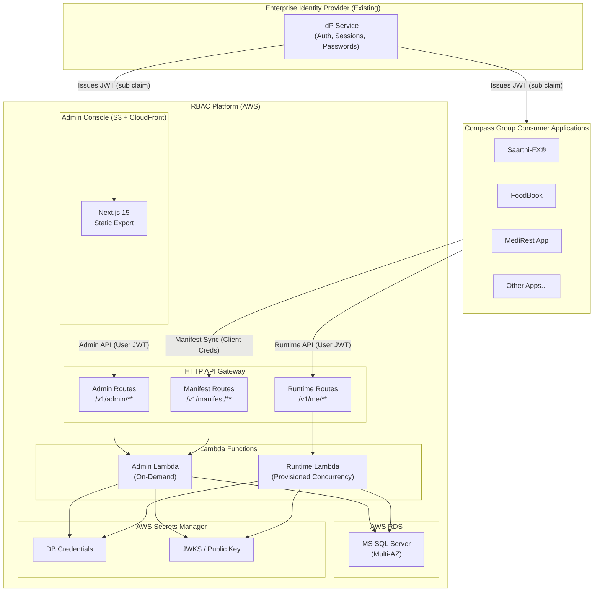
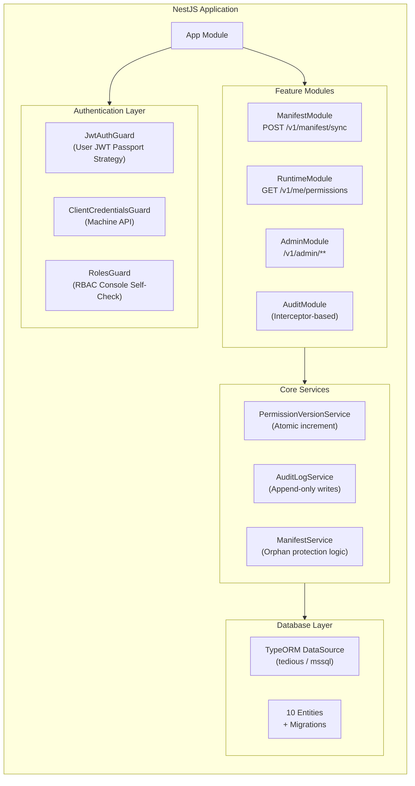
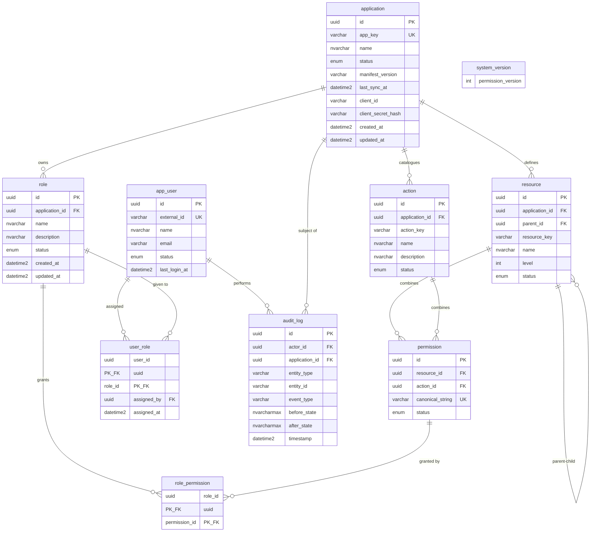
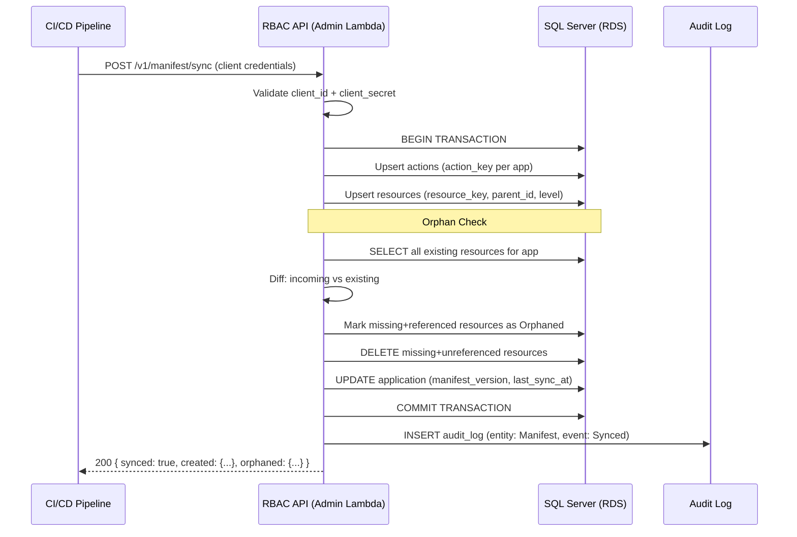
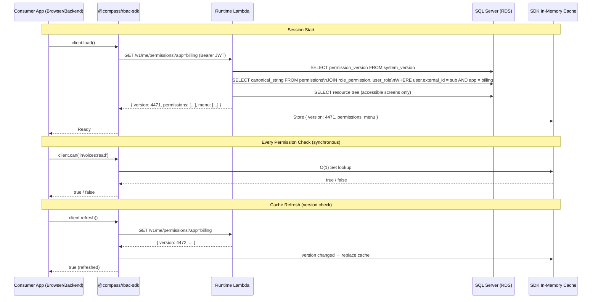
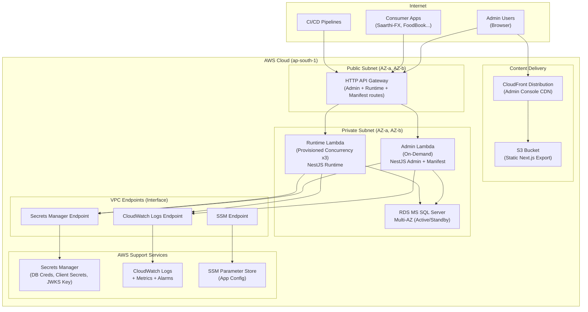

# Architecture Document
# Centralized RBAC Platform — Compass Group
### Technical Architecture & Design Reference

| Field | Value |
|---|---|
| **Document Version** | v1.0 |
| **Status** | Draft |
| **Authored by** | Platform Engineering |
| **Last Updated** | August 2026 |
| **Classification** | Internal — Engineering |

---

## Table of Contents

1. [System Overview](#1-system-overview)
2. [Architectural Principles](#2-architectural-principles)
3. [High-Level Architecture Diagram](#3-high-level-architecture-diagram)
4. [Component Architecture](#4-component-architecture)
   - 4.1 [RBAC Core API (NestJS)](#41-rbac-core-api-nestjs)
   - 4.2 [Admin Console (Next.js 15)](#42-admin-console-nextjs-15)
   - 4.3 [Client SDK (@compass/rbac-sdk)](#43-client-sdk-compassrbac-sdk)
   - 4.4 [Shared Contracts (packages/contracts)](#44-shared-contracts-packagescontracts)
5. [Data Architecture](#5-data-architecture)
6. [API Architecture](#6-api-architecture)
7. [Authentication & Authorization Architecture](#7-authentication--authorization-architecture)
8. [Manifest Sync Lifecycle](#8-manifest-sync-lifecycle)
9. [Runtime Permission Flow](#9-runtime-permission-flow)
10. [AWS Infrastructure Architecture](#10-aws-infrastructure-architecture)
11. [Network & Security Architecture](#11-network--security-architecture)
12. [Monorepo Structure](#12-monorepo-structure)
13. [Technology Stack Matrix](#13-technology-stack-matrix)
14. [Key Design Decisions & Trade-offs](#14-key-design-decisions--trade-offs)
15. [Scalability & Performance Design](#15-scalability--performance-design)
16. [Observability Architecture](#16-observability-architecture)
17. [Deployment Pipeline](#17-deployment-pipeline)

---

## 1. System Overview

The RBAC Platform is a **standalone authorization service** for Compass Group's multi-application enterprise digital ecosystem. It is explicitly **not** an authentication service — authentication, credential storage, and session management remain the responsibility of the existing enterprise Identity Provider (IdP).

The platform consists of four deployable units:

```
┌──────────────────────────────────────────────────────────────────────┐
│                      RBAC PLATFORM BOUNDARY                          │
│                                                                      │
│  ┌──────────────────┐    ┌───────────────────────────────────────┐  │
│  │  Admin Console   │    │           RBAC Core API               │  │
│  │  (Next.js 15)    │    │           (NestJS / Lambda)           │  │
│  │  S3 + CloudFront │    │  ┌─────────────┐  ┌───────────────┐  │  │
│  └──────────────────┘    │  │ Admin Lambda│  │Runtime Lambda │  │  │
│           │               │  └─────────────┘  └───────────────┘  │  │
│           │ Admin API     │           │                │          │  │
│           └───────────────┤           ▼                ▼          │  │
│                           │     ┌──────────────────────────┐      │  │
│                           │     │  MS SQL Server (AWS RDS)  │      │  │
│                           │     │  Multi-AZ (Production)    │      │  │
│                           │     └──────────────────────────┘      │  │
└───────────────────────────┴──────────────────────────────────────  ┘
```

| Deployable Unit | Technology | Hosting |
|---|---|---|
| RBAC Core API — Admin Lambda | NestJS + TypeORM | AWS Lambda (HTTP API GW) |
| RBAC Core API — Runtime Lambda | NestJS (lightweight) | AWS Lambda (Provisioned Concurrency) |
| Admin Console | Next.js 15 Static Export | S3 + CloudFront |
| Database | MS SQL Server | AWS RDS (Multi-AZ) |

---

## 2. Architectural Principles

| # | Principle | Applied As |
|---|---|---|
| **P1** | Separation of Concerns | Authorization is strictly decoupled from authentication and business logic |
| **P2** | Authorization as Infrastructure | All apps consume RBAC via a standard SDK — no custom auth code per app |
| **P3** | Data Integrity Over Deletion | Orphan protection: referenced permissions are never hard-deleted |
| **P4** | Immutable Audit Trail | `audit_log` table is append-only; no UPDATE/DELETE operations permitted |
| **P5** | Build-Time Declaration, Runtime Evaluation | Apps declare structure at CI/deploy time; permission evaluation happens at session start |
| **P6** | Cache Over Poll | The SDK caches permissions locally and invalidates via version counter — not per-request round-trips |
| **P7** | Self-Hosting | The Admin Console is itself an RBAC-registered application — dogfooding the same permission model |
| **P8** | Minimal Lambda Footprint | esbuild bundling, TypeORM + tedious (no native binaries), two-Lambda split |

---

## 3. High-Level Architecture Diagram



---

## 4. Component Architecture

### 4.1 RBAC Core API (NestJS)

The NestJS API is the central engine of the platform, organized into four primary modules:



**Module Breakdown:**

| Module | Responsibility | Auth Guard |
|---|---|---|
| `ManifestModule` | Parse manifest payload, upsert resources/actions, orphan protection | `ClientCredentialsGuard` |
| `RuntimeModule` | Compute effective permission snapshot per user per app, return menu tree | `JwtAuthGuard` |
| `AdminModule` | Full CRUD for apps, roles, users, assignments, audit log, settings | `JwtAuthGuard` + `RolesGuard` |
| `AuditModule` | NestJS interceptor that auto-writes audit entries on mutations | Internal |

**Lambda Split Strategy:**

```
apps/api/
├── src/                    # Shared NestJS codebase
├── lambda-admin.ts         # Entry: AdminModule + ManifestModule bootstrapped
└── lambda-runtime.ts       # Entry: RuntimeModule only (minimal deps, provisioned)
```

The Runtime Lambda deliberately excludes Admin modules to minimize bundle size and cold-start risk on the hot path.

---

### 4.2 Admin Console (Next.js 15)

The Admin Console is a **statically exported** Next.js 15 application served from S3 + CloudFront.

```
apps/console/
├── app/
│   ├── layout.tsx                  # Root layout, sidebar nav, auth context
│   ├── applications/
│   │   ├── page.tsx                # Screen 1: Application list
│   │   └── [id]/
│   │       └── page.tsx            # Screen 2: Application detail + tabs
│   ├── roles/
│   │   ├── page.tsx                # Screen 5: Roles list
│   │   └── [id]/
│   │       └── page.tsx            # Screen 6: Role detail + Permission Matrix
│   ├── users/
│   │   ├── page.tsx                # Screen 7: Users list
│   │   └── [id]/
│   │       └── page.tsx            # Screen 8: User detail
│   ├── assignments/
│   │   └── page.tsx                # Screen 9: Assignments
│   ├── audit-log/
│   │   ├── page.tsx                # Screen 10: Audit log list
│   │   └── [id]/
│   │       └── page.tsx            # Screen 11: Audit log detail
│   └── settings/
│       └── page.tsx                # Screen 12: System settings
├── components/
│   ├── PermissionMatrix/           # Complex tri-state permission builder
│   ├── ResourceTree/               # Recursive expandable screen tree
│   ├── AuditDiff/                  # Before/After JSON diff viewer
│   └── ui/                         # Shared design system components
├── lib/
│   ├── api-client.ts               # Typed API client (fetch wrapper)
│   └── rbac-sdk.ts                 # SDK instance for self-authorization
└── next.config.ts                  # output: 'export', basePath, env vars
```

**Permission Matrix Component — State Machine:**

The Permission Matrix is the most complex UI component. Its state logic:

```
For each (resource, action) cell:
  checked = role_permissions includes permission(resource.id, action.id)

For each parent resource row:
  childPermissions = all (child, action) cells
  triState =
    all checked  → FULL   (✓, solid checkbox, clicking → NONE)
    some checked → PARTIAL (─, mixed checkbox, clicking → FULL)
    none checked → NONE   (□, empty checkbox, clicking → FULL)
```

---

### 4.3 Client SDK (@compass/rbac-sdk)

The SDK is a private npm package published to the company's internal npm registry.

```typescript
// SDK Public API
class RBACClient {
  constructor(config: {
    rbacBaseUrl: string;
    appKey: string;
    getToken: () => Promise<string>; // User JWT supplier
  });

  // Fetch + cache permissions for the current user
  async load(): Promise<void>;

  // Synchronous boolean check (evaluates against local cache)
  can(permissionString: string): boolean;
  // e.g. client.can('invoices:read')  → true | false

  // Returns cached menu tree
  getMenu(): MenuNode[];

  // Check if cache is stale and re-fetch if needed
  async refresh(): Promise<boolean>; // true if refreshed
}

// Framework Middleware Helpers
function expressMiddleware(client: RBACClient, permission: string): RequestHandler;
function nextjsMiddleware(client: RBACClient, permission: string): NextMiddleware;
```

**Cache Invalidation Strategy:**

```
Client SDK maintains:
  - cachedVersion: number        (from last /v1/me/permissions response)
  - cachedPermissions: string[]  (flat list of canonical strings)
  - cachedMenu: MenuNode[]

On can() call:
  1. Return result from cachedPermissions (synchronous, < 1ms)

On session start / refresh():
  1. GET /v1/me/permissions?app={appKey}
  2. Compare response.version with cachedVersion
  3. If version differs → replace cache, bump cachedVersion
  4. If version same → no-op (cache still valid)
```

---

### 4.4 Shared Contracts (packages/contracts)

```typescript
// packages/contracts/src/

// Manifest Sync
export interface ManifestSyncRequest { ... }
export interface ManifestSyncResponse { ... }
export const ManifestSyncSchema: ZodSchema; // Runtime validation

// Permission Response
export interface PermissionsResponse {
  version: number;
  roles: string[];
  permissions: string[];
  menu: MenuNode[];
}

// Admin DTOs
export interface CreateRoleDto { ... }
export interface UpdateRolePermissionsDto { permissionIds: string[]; }
export interface CreateAssignmentDto { userId: string; roleId: string; }
export interface AuditLogEntry { ... }

// Canonical permission string parser
export function parsePermission(canonical: string): { resource: string; action: string };
export function buildPermission(resource: string, action: string): string;
```

---

## 5. Data Architecture

### Entity Relationship Diagram



### Database Design Decisions

| Decision | Rationale |
|---|---|
| **UUIDs as PKs** | Avoids sequential ID leakage; safe for multi-environment seeding |
| **Canonical permission string** (`resource:action`) | Enables fast flat-array lookup in SDK without joins |
| **`parent_id` self-referencing FK on `resource`** | Supports unlimited-depth screen tree without fixed schema |
| **`permission_version` in `system_version` table** | Single row, atomic increment — acts as an event counter to drive SDK cache invalidation |
| **`before_state` / `after_state` as `NVARCHAR(MAX)` JSON** | Avoids schema coupling; stores arbitrary entity state for audit without new columns |
| **`synchronize: false` in TypeORM** | All schema changes via explicit numbered migration files only |

### Orphan Protection Algorithm

```
On manifest sync for app X:
  incoming_resource_keys = Set(payload.resources.map(r => r.key))
  db_resource_keys = Set(SELECT resource_key FROM resource WHERE application_id = X)

  to_create = incoming_resource_keys - db_resource_keys
  to_delete_candidates = db_resource_keys - incoming_resource_keys

  for key in to_delete_candidates:
    has_active_permissions = EXISTS(
      SELECT 1 FROM role_permission rp
      JOIN permission p ON p.id = rp.permission_id
      JOIN resource r ON r.id = p.resource_id
      WHERE r.resource_key = key AND r.application_id = X
    )

    if has_active_permissions:
      UPDATE resource SET status = 'Orphaned' WHERE resource_key = key
    else:
      DELETE FROM resource WHERE resource_key = key   -- safe cleanup
```

---

## 6. API Architecture

### Three Distinct API Surfaces

```
                    ┌─────────────────────────────────────┐
                    │         HTTP API Gateway             │
                    └─────────────────────────────────────┘
                             │           │           │
             ┌───────────────┘           │           └──────────────┐
             ▼                           ▼                          ▼
    ┌─────────────────┐       ┌──────────────────┐       ┌──────────────────┐
    │  Machine API    │       │   Runtime API    │       │   Admin API      │
    │                 │       │                  │       │                  │
    │ POST            │       │ GET              │       │ Full CRUD on all │
    │ /v1/manifest/   │       │ /v1/me/          │       │ /v1/admin/**     │
    │ sync            │       │ permissions      │       │ entities         │
    │                 │       │                  │       │                  │
    │ Auth:           │       │ Auth:            │       │ Auth:            │
    │ Client Creds    │       │ User JWT         │       │ User JWT +       │
    │                 │       │                  │       │ RBAC Self-Check  │
    │ Consumer:       │       │ Consumer:        │       │ Consumer:        │
    │ CI/CD pipelines │       │ Consumer Apps    │       │ Admin Console    │
    │ & backend svcs  │       │ (via SDK)        │       │ UI               │
    └─────────────────┘       └──────────────────┘       └──────────────────┘
```

### URL Versioning Strategy

All endpoints are versioned via URL prefix (`/v1/`). Breaking changes increment the version. Non-breaking additive changes do not require a version bump.

### Error Response Schema

```json
{
  "statusCode": 400,
  "error": "BAD_REQUEST",
  "message": "app_key 'billing' not found",
  "requestId": "req_abc123",
  "timestamp": "2026-08-26T12:00:00.000Z"
}
```

---

## 7. Authentication & Authorization Architecture

### User API Authentication (Admin Console + Runtime)

```
User Browser/App                 RBAC API                         IdP
     │                              │                              │
     │──── GET /v1/me/permissions ──►│                              │
     │     Authorization: Bearer JWT │                              │
     │                              │──── Verify JWT signature ────►│
     │                              │     (JWKS endpoint or cached  │
     │                              │      public key)              │
     │                              │◄─── Valid / Invalid ─────────│
     │                              │                              │
     │                              │  If valid:                   │
     │                              │  Extract sub → external_id   │
     │                              │  Lookup app_user by          │
     │                              │  external_id                 │
     │                              │  Compute permissions union   │
     │◄── 200 PermissionsResponse ──│                              │
```

### Machine API Authentication (Manifest Sync)

```
CI/CD Pipeline                   RBAC API
     │                              │
     │── POST /v1/manifest/sync ───►│
     │   Authorization: Basic       │
     │   base64(client_id:secret)   │
     │                              │
     │                              │  1. Decode Basic auth header
     │                              │  2. Lookup application by client_id
     │                              │  3. bcrypt.compare(secret, stored_hash)
     │                              │  4. If match → proceed
     │                              │  5. If no match → 401 Unauthorized
     │◄── 200 Sync Result ─────────│
```

### Admin Console Self-Authorization

The Admin Console is registered as application `rbac-console` in the system. When a security admin accesses the console, the RBAC API validates:
1. The user's JWT (identity from IdP).
2. The user's role within the `rbac-console` application (authorization from RBAC itself).

This means SUPER_ADMIN, SECURITY_ADMIN, READ_ONLY_ADMIN are roles defined within RBAC for the `rbac-console` application.

---

## 8. Manifest Sync Lifecycle



---

## 9. Runtime Permission Flow



---

## 10. AWS Infrastructure Architecture



### CDK Stack Breakdown

| Stack | Resources Provisioned |
|---|---|
| `VpcStack` | VPC, 2 public subnets, 2 private subnets, NAT Gateway, Interface VPC Endpoints (Secrets Manager, CloudWatch Logs, SSM) |
| `DatabaseStack` | RDS SQL Server Express/SE (Multi-AZ), Security Group, Parameter Group, Subnet Group, Secrets Manager secret for credentials |
| `ApiStack` | HTTP API Gateway, Admin Lambda (Node.js 22, arm64, 512MB, on-demand), Runtime Lambda (Node.js 22, arm64, 256MB, provisioned concurrency 3), Lambda Security Group, IAM roles |
| `ConsoleStack` | S3 Bucket (private, versioned), CloudFront Distribution (HTTPS only, OAC), S3 Bucket Deployment |
| `PipelineStack` | CodePipeline for automated deployments (optional) |

---

## 11. Network & Security Architecture

### VPC Topology

```
VPC (10.0.0.0/16)
├── Public Subnet AZ-a  (10.0.1.0/24)  — NAT Gateway
├── Public Subnet AZ-b  (10.0.2.0/24)  — NAT Gateway (standby)
├── Private Subnet AZ-a (10.0.11.0/24) — Admin Lambda, Runtime Lambda, RDS Primary
└── Private Subnet AZ-b (10.0.12.0/24) — RDS Standby (Multi-AZ failover)
```

### Security Group Rules

| Security Group | Inbound | Outbound |
|---|---|---|
| `LambdaSG` | None (Lambda invoked via API GW, not directly) | Port 1433 to `RDSSG`, Port 443 to VPC Endpoints |
| `RDSSG` | Port 1433 from `LambdaSG` only | None |
| `VPCEndpointSG` | Port 443 from `LambdaSG` | None |

### Secret Management

| Secret | Store | Access |
|---|---|---|
| RDS master credentials | AWS Secrets Manager | Admin Lambda IAM role, Runtime Lambda IAM role |
| `client_secret` values | Stored as **bcrypt hash** in SQL Server, never in plain text | Never retrievable post-creation |
| IdP JWKS public key / cert | AWS Secrets Manager | Lambda retrieves on cold start, cached in-memory |

### Data Encryption

| Layer | Encryption |
|---|---|
| RDS at rest | AES-256 (AWS managed KMS key) |
| RDS in transit | SSL/TLS enforced (`Encrypt=yes;TrustServerCertificate=no`) |
| S3 at rest | SSE-S3 (AES-256) |
| API Gateway | HTTPS only (TLS 1.2 minimum) |
| Lambda environment variables | KMS encryption |

---

## 12. Monorepo Structure

```
rbac/                                        ← Git repository root
├── apps/
│   ├── api/                                 ← NestJS API
│   │   ├── src/
│   │   │   ├── app.module.ts
│   │   │   ├── manifest/
│   │   │   │   ├── manifest.controller.ts
│   │   │   │   ├── manifest.service.ts      ← Orphan algorithm
│   │   │   │   └── manifest.module.ts
│   │   │   ├── runtime/
│   │   │   │   ├── runtime.controller.ts
│   │   │   │   ├── runtime.service.ts       ← Permission union + menu build
│   │   │   │   └── runtime.module.ts
│   │   │   ├── admin/
│   │   │   │   ├── applications/
│   │   │   │   ├── roles/
│   │   │   │   ├── users/
│   │   │   │   ├── assignments/
│   │   │   │   ├── audit-log/
│   │   │   │   └── settings/
│   │   │   ├── auth/
│   │   │   │   ├── jwt.strategy.ts
│   │   │   │   ├── jwt-auth.guard.ts
│   │   │   │   └── client-credentials.guard.ts
│   │   │   ├── audit/
│   │   │   │   ├── audit.interceptor.ts     ← Auto audit logging
│   │   │   │   └── audit.service.ts
│   │   │   └── database/
│   │   │       ├── entities/                ← 10 TypeORM entity files
│   │   │       ├── migrations/              ← Numbered migration files
│   │   │       ├── seeds/                   ← Bootstrap seed script
│   │   │       └── database.module.ts
│   │   ├── lambda-admin.ts                  ← Admin Lambda entry point
│   │   ├── lambda-runtime.ts                ← Runtime Lambda entry point
│   │   ├── esbuild.admin.mjs                ← esbuild config (admin bundle)
│   │   ├── esbuild.runtime.mjs              ← esbuild config (runtime bundle)
│   │   └── package.json
│   │
│   └── console/                             ← Next.js 15 Admin Console
│       ├── app/
│       │   ├── layout.tsx
│       │   ├── applications/
│       │   ├── roles/
│       │   ├── users/
│       │   ├── assignments/
│       │   ├── audit-log/
│       │   └── settings/
│       ├── components/
│       │   ├── PermissionMatrix/
│       │   ├── ResourceTree/
│       │   └── AuditDiff/
│       ├── lib/
│       │   └── api-client.ts
│       ├── next.config.ts                   ← output: 'export'
│       └── package.json
│
├── packages/
│   ├── contracts/                           ← Shared TS types + Zod schemas
│   │   ├── src/
│   │   │   ├── manifest.contract.ts
│   │   │   ├── permissions.contract.ts
│   │   │   ├── admin.dtos.ts
│   │   │   └── index.ts
│   │   └── package.json
│   │
│   └── sdk/                                 ← @compass/rbac-sdk
│       ├── src/
│       │   ├── rbac-client.ts
│       │   ├── middleware/
│       │   │   ├── express.middleware.ts
│       │   │   └── nextjs.middleware.ts
│       │   └── index.ts
│       └── package.json
│
├── infra/                                   ← AWS CDK TypeScript
│   ├── lib/
│   │   ├── vpc-stack.ts
│   │   ├── database-stack.ts
│   │   ├── api-stack.ts
│   │   └── console-stack.ts
│   ├── bin/
│   │   └── rbac.ts                          ← CDK app entry
│   └── package.json
│
├── docs/
│   ├── PRD.md                               ← Product Requirements Document
│   ├── ARCHITECTURE.md                      ← This document
│   ├── wireframes.pdf
│   ├── rbac-technology-stack.pdf
│   └── json.jpeg
│
├── package.json                             ← pnpm workspace root
├── pnpm-workspace.yaml
├── tsconfig.base.json
├── .eslintrc.js
├── understanding.md
└── implementation_plan.md
```

---

## 13. Technology Stack Matrix

| Layer | Technology | Version | Rationale |
|---|---|---|---|
| **API Framework** | NestJS | v10 | Modular, opinionated, excellent TypeScript support, AWS Lambda compatible |
| **ORM** | TypeORM | v0.3 | SQL Server support via `tedious` — no native binaries unlike Prisma |
| **SQL Driver** | tedious | latest | Pure JavaScript MS SQL Server driver — Lambda-safe |
| **Database** | Microsoft SQL Server | 2019 SE | Enterprise requirement; hosted on AWS RDS |
| **Admin Console** | Next.js | v15 | React Server Components, App Router, static export for S3/CloudFront |
| **Runtime** | Node.js | v22 (arm64) | Lambda support, LTS, Graviton2 cost savings |
| **Language** | TypeScript | v5 | Full type safety across monorepo |
| **Schema Validation** | Zod | v3 | Runtime DTO validation in API + shared contracts |
| **Bundler (Lambda)** | esbuild | latest | < 1s build, tree-shaking, keeps bundle < 15MB |
| **Auth** | Passport.js + passport-jwt | v4 | JWT strategy for NestJS |
| **Package Manager** | pnpm | v9 | Workspace support, symlinked packages, fast installs |
| **Testing** | Jest + Supertest | v29 | Unit + E2E API tests |
| **IaC** | AWS CDK | v2 (TypeScript) | Type-safe cloud infrastructure |
| **CI/CD** | GitHub Actions | — | Automated test, build, migrate, deploy pipeline |
| **Logging** | Winston + CloudWatch | — | Structured JSON logs from Lambda to CloudWatch |

---

## 14. Key Design Decisions & Trade-offs

### Decision 1: TypeORM + tedious over Prisma

| | TypeORM + tedious | Prisma |
|---|---|---|
| **Bundle size** | ~3MB (pure JS) | ~35MB+ (includes Rust query engine binary) |
| **Lambda cold start** | ✅ Fast | ❌ Slow (large binary) |
| **SQL Server support** | ✅ Native via tedious | ⚠️ Limited (Preview as of 2026) |
| **Migration tooling** | ✅ Built-in migration runner | ✅ Excellent |
| **Type safety** | ✅ Good | ✅ Excellent |
| **Verdict** | **Selected** | Rejected |

### Decision 2: Two-Lambda Split (Admin vs Runtime)

The runtime Lambda (`GET /v1/me/permissions`) is on the hot path — called by every user session start across all consumer apps. Isolating it into its own Lambda function allows:
- **Provisioned concurrency** without paying for idle admin Lambda warmth.
- **Minimal dependencies** — no admin modules, smaller bundle.
- **Independent scaling** — can scale runtime independently.

Trade-off: Two build/deploy targets to maintain.

### Decision 3: Static Next.js Export over SSR

The Admin Console uses `output: 'export'` (static HTML/JS) served from S3 + CloudFront instead of a server-rendered Next.js deployment (e.g., on EC2/Lambda).

- **Pro**: Eliminates server hosting cost; CDN-distributed; trivially scalable.
- **Pro**: No server-side secrets in the frontend — all API calls use user JWT.
- **Con**: No server-side rendering; no dynamic routing on server. Acceptable for an internal admin tool.

### Decision 4: Monotonic `permission_version` Counter over Event Queues

SDK cache invalidation is driven by a single `permission_version` integer in `system_version` table rather than a message queue (e.g., SNS/SQS push).

- **Pro**: Zero additional infrastructure; simple; works across Lambda cold starts.
- **Pro**: Pull-based — clients check on their own schedule, no thundering herd on permission changes.
- **Con**: Slightly stale window (permissions change but client doesn't refresh until next API call).
- **Acceptable**: Admin-driven authorization changes are not time-critical to the millisecond.

---

## 15. Scalability & Performance Design

### Runtime Lambda Performance Budget

| Stage | Budget | Implementation |
|---|---|---|
| SDK `can()` call | < 1ms | In-memory Set lookup |
| SDK `refresh()` check (version only) | < 10ms | Single `GET /v1/me/permissions` (cached RDS query) |
| Cold start (Runtime Lambda) | < 800ms | Provisioned concurrency eliminates this |
| Full permissions query (DB) | < 20ms | Indexed query on `external_id`, `app_key` |
| End-to-end API P99 | < 50ms | Provisioned concurrency + indexed SQL |

### Database Indexing Strategy

```sql
-- Critical indexes for runtime query performance
CREATE INDEX idx_app_user_external_id ON app_user(external_id);
CREATE INDEX idx_user_role_user_id ON user_role(user_id);
CREATE INDEX idx_user_role_role_id ON user_role(role_id);
CREATE INDEX idx_role_application_id ON role(application_id);
CREATE INDEX idx_permission_canonical ON permission(canonical_string);
CREATE INDEX idx_resource_app_key ON resource(application_id, resource_key);
CREATE INDEX idx_audit_log_timestamp ON audit_log(timestamp DESC);
CREATE INDEX idx_audit_log_actor ON audit_log(actor_id);
```

### Connection Pooling

TypeORM `DataSource` is initialized once per Lambda execution environment and reused across invocations (warm start reuse). Configuration:

```typescript
{
  type: 'mssql',
  extra: {
    pool: {
      min: 2,
      max: 10,           // Per Lambda instance; AWS Lambda max concurrency controls total
      acquireTimeoutMillis: 3000,
      idleTimeoutMillis: 30000,
    }
  }
}
```

---

## 16. Observability Architecture

### Structured Logging (CloudWatch)

Every Lambda emits JSON log lines:

```json
{
  "level": "info",
  "timestamp": "2026-08-26T12:00:00.000Z",
  "requestId": "req_abc123",
  "service": "rbac-runtime",
  "userId": "usr_xyz",
  "appKey": "billing",
  "event": "permissions_fetched",
  "permissionCount": 12,
  "durationMs": 18
}
```

### CloudWatch Metrics (Custom)

| Metric | Emitted By | Alert Threshold |
|---|---|---|
| `ManifestSyncDuration` | Admin Lambda | > 5000ms |
| `PermissionQueryDuration` | Runtime Lambda | > 100ms |
| `OrphanedResourceCount` | Admin Lambda | > 0 (notify) |
| `PermissionVersionBump` | Admin Lambda | — (informational) |
| `AuthFailures` | Both Lambdas | > 10/min → PagerDuty |

### Distributed Tracing

API Gateway passes `x-correlation-id` header → Lambda logs include it → enables request tracing across Admin Console → API calls.

---

## 17. Deployment Pipeline

```mermaid
flowchart LR
    PR["Pull Request\n(Feature Branch)"] --> Tests["Unit + E2E\nTests (Jest)"]
    Tests --> Build["Build Lambdas\n(esbuild)"]
    Build --> Synth["CDK Synth\n(validate stacks)"]
    Synth --> Merge["Merge to main"]
    Merge --> MigrateStaging["Run DB Migrations\n(Staging RDS)"]
    MigrateStaging --> DeployStaging["Deploy Lambdas\n(Staging)"]
    DeployStaging --> IntTest["Integration\nTests (Staging)"]
    IntTest --> Approve["Manual Approval\n(Engineering Lead)"]
    Approve --> MigrateProd["Run DB Migrations\n(Production RDS)"]
    MigrateProd --> DeployProd["Deploy Lambdas\n(Production)"]
    DeployProd --> DeployConsole["Deploy Console\n(S3 Sync + CF Invalidation)"]
    DeployConsole --> Done["✅ Live"]
```



**Critical CI Rules:**
1. Migrations **always** run before Lambda deployment — never after.
2. Lambda deployment uses `--no-rollback` guard: if migration fails, Lambda deploy is aborted.
3. Provisioned concurrency update runs after Lambda version publish — zero-downtime swap.
4. CloudFront cache is invalidated (`/*`) after every S3 console deployment.