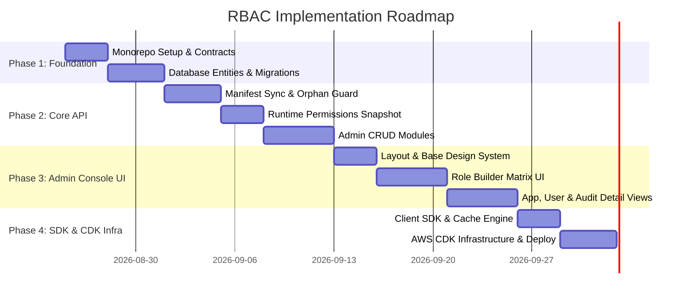

# Centralized RBAC Platform — Implementation Plan

This document outlines the full technical architecture, implementation roadmap, database design, API contracts, frontend component specifications, and deployment strategy for building the enterprise Centralized Role-Based Access Control (RBAC) Platform across all **Compass Group** applications (including *Saarthi-FX®*, *FoodBook*, *MediRest App*, *Shield*, *Insights*, *SmartQ Platforms*, *Learning Platform*, etc.).

---

## User Review Required

> [!IMPORTANT]
> **Database Engine & ORM**: As specified in the technology stack guidelines, Microsoft SQL Server hosted on AWS RDS is paired with **TypeORM (`tedious` driver)** instead of Prisma. This avoids including heavy native binaries in AWS Lambda cold starts.

> [!IMPORTANT]
> **Infrastructure & Networking Cost Optimization**: AWS Lambdas deployed inside private subnets require VPC Endpoints for Secrets Manager and CloudWatch Logs to eliminate NAT Gateway egress billing spikes and latency.

> [!WARNING]
> **Manifest Sync Safety Policy**: Hard deletion of permissions is strictly prohibited. If an application sync drops a screen or action, the RBAC engine flags it as `Orphaned` / `Deprecated` if referenced by any role.

---

## Open Questions

1.  **Identity Provider Integration (JWT Verification)**:
    *   Does the existing IdP publish a standard JWKS endpoint (JSON Web Key Set, e.g. OpenID Connect `.well-known/jwks.json`) for public key discovery, or will the public key / cert be injected via AWS Secrets Manager?
2.  **Machine API Authentication Scheme**:
    *   Is OAuth 2.0 Client Credentials flow (`/v1/oauth/token`) preferred for build-time manifest sync, or static HMAC API Keys issued per registered application?

---

## Proposed Changes

### Monorepo Structure (`rbac/`)

The repository will be structured as a monorepo using npm/pnpm workspaces:

```
rbac/
├── apps/
│   ├── api/                 # NestJS Service (Admin API + Machine API + Runtime API)
│   └── console/             # Next.js 15 Admin Console (Static Export)
├── packages/
│   ├── contracts/           # Shared TypeScript DTOs, Zod Schemas & Interfaces
│   └── sdk/                 # Client Library (@company/rbac-sdk) for consuming apps
├── infra/                   # AWS CDK TypeScript Stacks
├── docs/                    # Architecture, Wireframe & Payload Documentation
├── understanding.md         # Comprehensive Project Analysis & Domain Model
└── implementation_plan.md   # Technical Implementation Plan & Roadmap
```

---

### Component 1: Database Schema & Data Layer (`apps/api/src/database`)

#### [NEW] TypeORM Data Entities & Migration Scripts
Implement 9 SQL Server TypeORM entities:
- [Application Entity](file:///c:/Users/RetailAdmin/OneDrive/Desktop/rbac/apps/api/src/database/entities/application.entity.ts): Application registry and client credentials.
- [Action Entity](file:///c:/Users/RetailAdmin/OneDrive/Desktop/rbac/apps/api/src/database/entities/action.entity.ts): Action catalog (`read`, `write`, `update`, `delete`, `export`, etc.).
- [Resource Entity](file:///c:/Users/RetailAdmin/OneDrive/Desktop/rbac/apps/api/src/database/entities/resource.entity.ts): Screen hierarchy with `parent_id` tree links.
- [Permission Entity](file:///c:/Users/RetailAdmin/OneDrive/Desktop/rbac/apps/api/src/database/entities/permission.entity.ts): Resource + Action pair with canonical string format.
- [Role Entity](file:///c:/Users/RetailAdmin/OneDrive/Desktop/rbac/apps/api/src/database/entities/role.entity.ts): App-scoped roles.
- [RolePermission Entity](file:///c:/Users/RetailAdmin/OneDrive/Desktop/rbac/apps/api/src/database/entities/role-permission.entity.ts): Role to permission mappings.
- [AppUser Entity](file:///c:/Users/RetailAdmin/OneDrive/Desktop/rbac/apps/api/src/database/entities/app-user.entity.ts): IdP user identity mirror.
- [UserRole Entity](file:///c:/Users/RetailAdmin/OneDrive/Desktop/rbac/apps/api/src/database/entities/user-role.entity.ts): User assignment mappings.
- [AuditLog Entity](file:///c:/Users/RetailAdmin/OneDrive/Desktop/rbac/apps/api/src/database/entities/audit-log.entity.ts): Immutable JSON audit logs.
- [SystemVersion Entity](file:///c:/Users/RetailAdmin/OneDrive/Desktop/rbac/apps/api/src/database/entities/system-version.entity.ts): Monotonic `permission_version` counter.

---

### Component 2: NestJS Backend Service (`apps/api`)

#### [NEW] Core Modules & Controllers
- **`ManifestModule`**: Implements `POST /v1/manifest/sync` with orphan protection logic.
- **`RuntimeModule`**: Implements `GET /v1/me/permissions?app={app_key}` returning permissions snapshot, menu tree, and current `permission_version`.
- **`AdminModule`**: REST API endpoints backing the 12 Admin Console screens:
  - `GET / POST / PUT / DELETE /v1/admin/applications`
  - `GET / POST / PUT /v1/admin/resources` & `actions`
  - `GET / POST / PUT / DELETE /v1/admin/roles`
  - `GET / POST / PUT /v1/admin/users`
  - `GET / POST / DELETE /v1/admin/assignments`
  - `GET /v1/admin/audit-logs`
- **`AuthGuard` / `JwtStrategy`**: Passport strategy validating IdP user JWT tokens.
- **`ClientCredentialsGuard`**: Guard validating machine-to-machine API calls for manifest sync.
- **`LambdaAdapter`**: `lambda.ts` serverless express adapter caching bootstrapped Nest app context across invocations.

---

### Component 3: Next.js Admin Console (`apps/console`)

#### [NEW] UI Modules & Page Routes
Build Next.js 15 app router with static export (`output: 'export'`) styled with modern CSS & glassmorphic design system:
- **`app/applications/`**: App list & detail drill-down (Pages 1 & 2).
- **`app/screens-actions/`**: Resource tree viewer & Action catalogue (Pages 3 & 4).
- **`app/roles/`**: Role management & **Interactive Matrix Permission Builder** (Pages 5 & 6).
- **`app/users/`**: User list & user profile drill-down (Pages 7 & 8).
- **`app/assignments/`**: User-to-role assignment control table (Page 9).
- **`app/audit-log/`**: Timeline log viewer & JSON diff visualizer (Pages 10 & 11).
- **`app/settings/`**: System configuration & default actions setup (Page 12).

---

### Component 4: Shared Contracts & Client SDK (`packages/`)

#### [NEW] Contracts (`packages/contracts`)
- Zod schemas & TypeScript types shared between API and Console (Manifest DTOs, Role Matrix DTOs, Permission String parsers).

#### [NEW] SDK (`packages/sdk`)
- `@company/rbac-sdk`: NPM package containing:
  - `RBACClient`: Fetches and caches permissions locally against `permission_version`.
  - `can(permissionString)`: Boolean evaluator (e.g. `can('invoices:read')`).
  - Express / Fastify / Next.js middleware helpers for automated route protection.

---

### Component 5: AWS Infrastructure as Code (`infra/`)

#### [NEW] AWS CDK Stacks (`infra/lib/`)
- `VpcStack`: VPC with private subnets and Secrets Manager / CloudWatch VPC Endpoints.
- `DatabaseStack`: AWS RDS SQL Server Instance (Multi-AZ in prod).
- `ApiStack`: HTTP API Gateway + 2 Lambda Functions:
  - `RuntimeLambda`: Provisioned concurrency for low latency `/v1/me/permissions`.
  - `AdminLambda`: Standard on-demand execution.
- `ConsoleStack`: S3 Bucket + CloudFront CDN distribution serving static Next.js export.

---

## Technical Roadmap & Implementation Phases



---

## Verification Plan

### Automated Tests
*   **Unit Tests (`apps/api`)**: Test `ManifestService` orphan detection algorithm, `RoleBuilder` state calculations, and `permission_version` transaction logic using Jest.
*   **SDK Tests (`packages/sdk`)**: Verify client cache invalidation when `permission_version` changes.
*   **E2E Tests (`apps/api`)**: End-to-end API tests for manifest ingestion and authorization snapshot calculation.

### Manual & Visual Verification
*   **Role Builder Matrix UI**: Test parent/child screen tri-state selection (Full, Partial, None) and bulk toggle actions in the browser.
*   **Manifest Sync Drift Test**: Push a mock application manifest, verify resources and actions appear in the Admin UI, then simulate an updated manifest with removed screens to verify orphaned status handling.
*   **CDK Synthesis**: Run `cdk synth` and `cdk diff` to validate AWS stack resource generation.