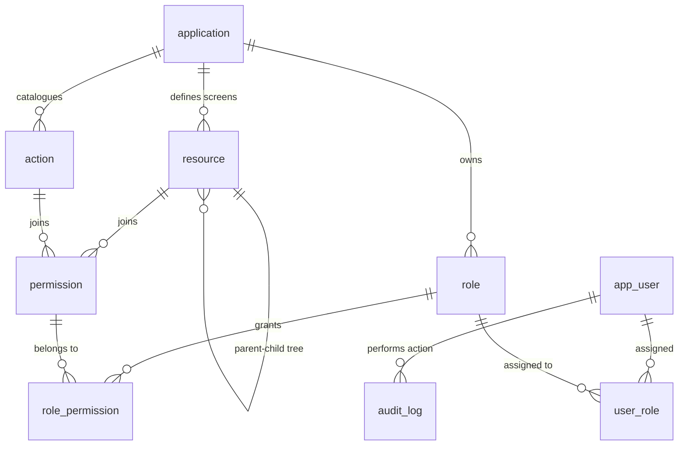

# RBAC Centralized System — Project Understanding & Architecture Analysis

## 1. Executive Summary

The **Centralized Role-Based Access Control (RBAC) Platform** is an enterprise-grade authorization service and administration engine engineered specifically for **Compass Group**'s multi-application digital platform. Today, multiple applications across Compass Group independently implement roles, permissions, screen mappings, and authorization checks. This duplication leads to code drift, inconsistent security policies, audit trail gaps, and high engineering overhead when creating or modifying applications.

The new central RBAC service establishes a single source of truth for authorization across all Compass Group enterprise applications (such as *Saarthi-FX®*, *FoodBook*, *MediRest App*, *Shield*, *Insights*, *SmartQ Platforms*, *Learning Platform*, etc.). 

Key system objectives include:
*   **Decoupling Authorization from Application Code**: Applications no longer manage role definitions or user-role assignments; they declare their screen/action catalogue via manifest sync and query the RBAC runtime engine.
*   **Centralized Admin Console**: A dedicated management portal for security administrators to inspect applications, configure roles via an interactive Matrix Permission Builder, assign roles to users, and audit every authorization event.
*   **High Performance Runtime & Caching**: Zero runtime polling per screen. Applications retrieve authorization snapshots once per user session and cache them against a version counter.

---

## 2. Core Architectural & Business Decisions

Based on the project brief, technology stack specifications, sample payloads, and wireframe designs, five foundational decisions govern the system architecture:

```
┌─────────────────────────────────────────────────────────────────────────┐
│                      Identity Provider (Existing IdP)                    │
│           (Handles User Authentication, Passwords & Sessions)           │
└─────────────────────────────────────────────────────────────────────────┘
                                    │
                         Issues JWT (external_id)
                                    ▼
┌─────────────────────────────────────────────────────────────────────────┐
│                           RBAC Platform                                 │
│  ┌─────────────────────────────────┐   ┌─────────────────────────────┐  │
│  │     Central Admin Console       │   │      RBAC Core Engine       │  │
│  │   (Next.js Static Export / S3)  │   │  (NestJS on AWS Lambda/RDS) │  │
│  └─────────────────────────────────┘   └─────────────────────────────┘  │
└─────────────────────────────────────────────────────────────────────────┘
                 ▲                                       ▲
   Admin API (User JWT)                     Machine API (Client Credentials)
                 │                                       │
┌────────────────┴─────────────────┐   ┌─────────────────┴─────────────┐
│       Security Admin / User       │   │  Consumer App Build/CI Sync   │
└──────────────────────────────────┘   └───────────────────────────────┘
```

1.  **Strict Authorization Scope (No Identity Storage)**:
    *   Authentication remains with the existing enterprise Identity Provider (IdP).
    *   RBAC does **not** store credentials or issue login sessions. It maintains a light mirror table (`app_user`) keyed on `external_id` (UUID / IdP subject identifier).
2.  **Screen-Level Permissions with Dynamic Actions**:
    *   A permission is defined as a tuple of `Resource (Screen)` + `Action`.
    *   Actions are first-class data elements (`read`, `write`, `update`, `delete`, `export`, `approve`, `publish`), not hardcoded enums. Applications dynamically register custom actions without schema migrations.
3.  **Application-Scoped Roles & No Scoping Overhead in v1**:
    *   Roles belong strictly to a single application and cannot cross application boundaries.
    *   A user can hold multiple roles per application; effective permissions are computed as the **union** of all granted roles.
4.  **Self-Managing Architecture**:
    *   The RBAC Admin Console itself is registered as an application (`rbac-console`) inside the system tables, inheriting the same role/permission evaluation engine.
5.  **Build-Time Sync & Session-Based Runtime Caching**:
    *   **Build/CI Phase**: Applications post their screen and action manifest upon deployment (`POST /v1/manifest/sync`).
    *   **Runtime Phase**: Consuming applications call `GET /v1/me/permissions?app={app_key}` once per user session and cache results locally using an SDK `can()` helper.

---

## 3. Scope Breakdown & System Boundaries

### In-Scope (v1 Requirements)
*   **Monorepo Structure**: NestJS API, Next.js Admin UI, Shared Contracts, Private Client SDK, AWS CDK Infrastructure.
*   **Manifest Sync Engine**: Idempotent endpoint to parse resources, screen trees, and actions. Safe handling of removed screens (marking as deprecated/orphaned, never hard-deleting active permissions).
*   **Role & Permission Builder UI**: Interactive matrix UI featuring screen hierarchy trees, action columns, tri-state checkboxes (Full, Partial, None), and bulk operations.
*   **Audit Logging**: Detailed immutable trail capturing before/after JSON diffs for role changes, assignment modifications, and manifest sync events.
*   **SDK Package**: Private npm package providing HTTP client caching, `can(permissionString)` check, and route middleware helpers.

### Out-of-Scope (v1 Non-Goals)
*   **Row-Level / Record-Level Security**: Policy-based data row filtering (deferred to post-v1).
*   **Delegated Multi-Tenant App Administration**: Granular per-app admin ownership (deferred; cheap `user_application` guard designed as fallback).
*   **Custom Login / Credential Storage**: Managed entirely by external IdP.

---

## 4. Comprehensive Domain & Data Model

The data model consists of 9 core tables hosted in Microsoft SQL Server on AWS RDS:



### Entity Specifications

1.  **`application`**: Product registry.
    *   `id` (UUID, PK)
    *   `app_key` (VARCHAR, Unique - e.g. `saarthi_fx`, `billing`)
    *   `name` (NVARCHAR)
    *   `status` (ENUM: `Active`, `Inactive`)
    *   `manifest_version` (VARCHAR)
    *   `last_sync_at` (DATETIME2)
    *   `client_id` & `client_secret_hash` (Machine API Credentials)
    *   `created_at`, `updated_at`

2.  **`action`**: Available operations catalog per application.
    *   `id` (UUID, PK)
    *   `application_id` (FK -> application)
    *   `action_key` (VARCHAR - `read`, `write`, `update`, `delete`, `export`, `approve`, `publish`)
    *   `name` (NVARCHAR)
    *   `description` (NVARCHAR)
    *   `status` (ENUM: `Active`, `Deprecated`)

3.  **`resource`**: Screen/module tree structure.
    *   `id` (UUID, PK)
    *   `application_id` (FK -> application)
    *   `parent_id` (FK -> resource, Nullable for root screens)
    *   `resource_key` (VARCHAR - e.g. `invoices`, `invoices.credit_note`)
    *   `name` (NVARCHAR)
    *   `level` (INT - Depth in tree)
    *   `status` (ENUM: `Active`, `Deprecated`, `Orphaned`)

4.  **`permission`**: Unique pair of Resource + Action.
    *   `id` (UUID, PK)
    *   `resource_id` (FK -> resource)
    *   `action_id` (FK -> action)
    *   `canonical_string` (VARCHAR, Unique - e.g. `invoices:read`, `invoices.credit_note:write`)
    *   `status` (ENUM: `Active`, `Orphaned`)

5.  **`role`**: Application-scoped role definitions.
    *   `id` (UUID, PK)
    *   `application_id` (FK -> application)
    *   `name` (NVARCHAR)
    *   `description` (NVARCHAR)
    *   `status` (ENUM: `Active`, `Inactive`)
    *   `created_at`, `updated_at`

6.  **`role_permission`**: Join table mapping permissions to roles.
    *   `role_id` (FK -> role, PK)
    *   `permission_id` (FK -> permission, PK)

7.  **`app_user`**: IdP user mirror.
    *   `id` (UUID, PK)
    *   `external_id` (VARCHAR, Unique - IdP sub claim)
    *   `name` (NVARCHAR)
    *   `email` (VARCHAR)
    *   `status` (ENUM: `Active`, `Inactive`)
    *   `last_login_at` (DATETIME2)

8.  **`user_role`**: User assignment mapping.
    *   `user_id` (FK -> app_user, PK)
    *   `role_id` (FK -> role, PK)
    *   `assigned_by` (FK -> app_user)
    *   `assigned_at` (DATETIME2)

9.  **`audit_log`**: Immutable audit log.
    *   `id` (UUID, PK)
    *   `actor_id` (FK -> app_user)
    *   `application_id` (FK -> application, Nullable)
    *   `entity_type` (VARCHAR - `Role`, `Assignment`, `Permission`, `Manifest`)
    *   `entity_id` (VARCHAR)
    *   `event_type` (VARCHAR - `Created`, `Updated`, `Deleted`, `Synced`)
    *   `before_state` (NVARCHAR(MAX) - JSON snapshot)
    *   `after_state` (NVARCHAR(MAX) - JSON snapshot)
    *   `timestamp` (DATETIME2)

10. **`system_version`**: Global permission version counter.
    *   `permission_version` (INT) - Monotonically increasing counter bumped on any role or assignment update to invalidate client SDK caches.

---

## 5. Admin Console Page Breakdown (Analysis of 12 Wireframe Screens)

| # | Screen Name | Key UI Elements & Controls | Technical & API Logic |
|---|---|---|---|
| **1** | **Applications List** | Search bar, status tags, manifest version, last sync time, Add Application button. | Fetches `GET /v1/admin/applications`. Supports search, pagination, and status filters. |
| **2** | **Application Detail** | Header stats cards (Version, Last Sync, Total Screens, Total Actions), About text, Manifest Endpoint, Sync Now button, Tab navigation. | Aggregate query retrieving counts across resources/actions/roles for the application. Sync button triggers manual re-fetch. |
| **3** | **Screens & Actions (Screens Tab)** | App selector, resource search, hierarchical tree list (Level 1, Level 2 indentations), status badge, "+ View Tree" modal toggle. | Queries `GET /v1/admin/applications/:id/resources`. Renders recursive tree with collapse/expand toggles. |
| **4** | **Actions Tab** | App selector, search, actions table (Name, Key, Description, Status), + Add Custom Action button. | Queries `GET /v1/admin/applications/:id/actions`. Allows appending custom actions if app requires non-standard operation. |
| **5** | **Roles List** | App selector, search bar, role table (Role Name, Description, User Count, Permission Count, Status), + Create Role button. | Fetches `GET /v1/admin/roles?appId=...` with aggregated user and permission counts per role. |
| **6** | **Role Detail & Permission Builder** | Matrix Grid: Screens (rows) x Actions (columns), Tri-state parent checkboxes (Full/Partial/None), Bulk action buttons (Select All, Deselect All, Expand/Collapse All), Save/Cancel buttons. | **Complex Component**: Calculates tri-state logic based on child screen permissions. Submits `PUT /v1/admin/roles/:id` with complete permission matrix ID set. Bumps global `permission_version`. |
| **7** | **Users List** | Search bar, user list table (Name, Email, Status, App count, Last Login), + Add User button. | Queries `GET /v1/admin/users`. Includes active application counts derived from `user_role` mapping. |
| **8** | **User Detail (Drill Down)** | User info banner, tabs (Applications & Roles, Activity), mapping table showing applications and assigned roles, Edit User button. | Retrieves `GET /v1/admin/users/:id/roles` grouped by application key. |
| **9** | **Assignments** | User / Application / Role filters, search bar, assignment table (User, App, Role, Assigned Date, Assigned By, Actions), + Add Assignment button. | Queries `GET /v1/admin/assignments`. Create/Delete updates `user_role` table and bumps global `permission_version`. |
| **10** | **Audit Log** | Filter controls (Application, Event, Entity, Date Range), search input, timeline table. | Queries `GET /v1/admin/audit-logs` with server-side pagination and JSON state inspection. |
| **11** | **Audit Log Detail** | Header metadata (Event, Entity, Actor, Time), side-by-side Before/After diff card. | Formats raw JSON strings into structured, human-readable diff views. |
| **12** | **Settings** | Global Actions catalog table, System Settings form (Session Timeout, Password Policy, MFA toggle, Manifest Sync Interval, Audit Retention). | CRUD for system defaults and runtime configuration parameters. |

---

## 6. Runtime & API Surface Specifications

### Surface 1: Machine API (Build/CI & Service Integration)
*   **Auth**: Client ID + Client Secret (OAuth 2.0 Client Credentials or `X-API-Key`).
*   **Key Endpoint**: `POST /v1/manifest/sync`
    *   **Payload**:
        ```json
        {
          "app": "billing",
          "version": "2026.08.11",
          "actions": ["read", "write", "update", "delete", "export"],
          "resources": [
            {
              "key": "invoices",
              "name": "Invoices",
              "actions": ["read", "write", "update", "delete", "export"]
            },
            {
              "key": "invoices.credit_note",
              "name": "Credit notes",
              "parent": "invoices",
              "actions": ["read", "write"]
            }
          ]
        }
        ```
    *   **Orphan Protection Logic**: If a screen or action present in DB is missing from the incoming manifest, check if any `role_permission` references it.
        *   If referenced: Update status to `Orphaned` / `Deprecated`. Do NOT delete.
        *   If unreferenced: Clean up safely.

### Surface 2: Runtime API (Session Permission Snapshot)
*   **Auth**: User JWT from IdP (contains `sub` / `external_id`).
*   **Endpoint**: `GET /v1/me/permissions?app=billing`
*   **Response**:
    ```json
    {
      "version": 4471,
      "roles": ["billing_clerk"],
      "permissions": [
        "invoices:read",
        "invoices:write",
        "invoices:export"
      ],
      "menu": [
        {
          "key": "invoices",
          "name": "Invoices",
          "children": [
            {
              "key": "invoices.credit_note",
              "name": "Credit notes",
              "children": []
            }
          ]
        }
      ]
    }
    ```

---

## 7. Critical Technical Considerations & Risks

1.  **Database Concurrency & Migration Lock**:
    *   Migrations must run in a gated CI step before deployment, never on Lambda cold starts, to avoid deadlocks across multiple AWS Lambda execution environments.
    *   `synchronize: true` in TypeORM **must be disabled** across all environments.
2.  **Lambda Cold Starts & Bundle Optimization**:
    *   Using TypeORM with `tedious` driver instead of Prisma (which includes a heavy Rust binary query engine).
    *   Bundling via `esbuild` to keep Lambda package size under 15MB.
    *   Splitting compute into two Lambdas:
        *   `runtime-lambda`: Hot path, minimal dependencies, provisioned concurrency.
        *   `admin-lambda`: Standard on-demand execution.
3.  **VPC Networking Constraints**:
    *   Lambdas running inside private subnets to access RDS SQL Server must utilize **VPC Endpoints** (Interface Endpoints) for AWS Secrets Manager and CloudWatch to minimize NAT Gateway data egress costs and latency.
4.  **Bootstrap Migration**:
    *   The initial seed script must seed:
        1.  `rbac-console` application record.
        2.  Its screens, actions, and permissions.
        3.  `SUPER_ADMIN` role with 100% permission coverage.
        4.  Initial Super Admin user assignment.